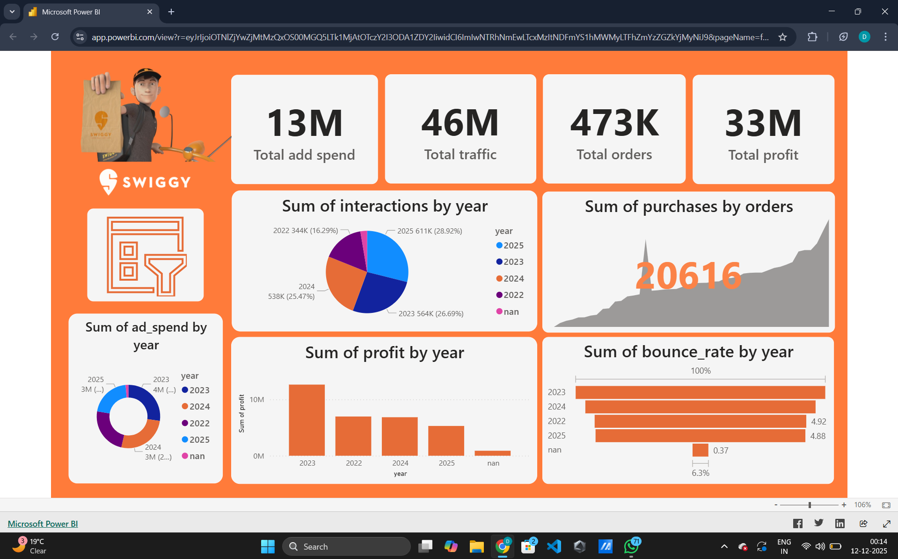

# swiggy_marketing_analysis (2022 - 2025)
Data analytics project shocasing swiggy marketing analysis using python, mysql, power bi

# 📊 Swiggy Marketing Analysis

## 📌 Project Overview

This project analyzes **Swiggy’s marketing and performance metrics** from **2022 to 2025** using:

* **Python** (Data Cleaning & EDA)
* **MySQL** (Data Storage, SQL Queries & Analysis)
* **Power BI** (Interactive Dashboard & Reporting)

The dashboard provides insights into **ad spend, traffic, orders, profit, bounce rate, and user interactions** across multiple years.

---

## 🧩 Key Insights from Dashboard

### 🔸 **1. Total Marketing & Business KPIs**

| Metric             | Value    |
| ------------------ | -------- |
| **Total Ad Spend** | **13M**  |
| **Total Traffic**  | **46M**  |
| **Total Orders**   | **473K** |
| **Total Profit**   | **33M**  |

---

### 🔸 **2. Yearly Interactions**

Pie-chart representing customer interactions:

* **2025:** 611K
* **2024:** 538K
* **2023:** 564K
* **2022:** 344K

---

### 🔸 **3. Purchases Trend**

A continuous rising trend with a peak shown with **20,616 orders**.

---

### 🔸 **4. Ad Spend by Year**

* Values vary across 2022–2025 showing different marketing investment patterns.

---

### 🔸 **5. Profit by Year**

* Highest profit recorded in **2023**
* Gradual decline after 2024

---

### 🔸 **6. Bounce Rate by Year**

* 2023 and 2024 show higher bounce rates
* Minimal bounce rate in **2022** and slight increase in **2025**

---

## 🛠️ Technologies Used

### ✔️ **Python**

* Data cleaning
* Exploratory Data Analysis (EDA)
* CSV preprocessing
* Pandas, NumPy, Matplotlib

### ✔️ **MySQL**

* Stored cleaned dataset
* Performed analytical SQL queries
* Used `GROUP BY`, Window functions, Joins, etc.

### ✔️ **Power BI**

* Created interactive dashboard
* Forecasting & trend analysis
* Chart visualization and KPI cards

---

## 🧪 SQL Queries Used

Some major SQL operations include:

### ✔️ **Top Purchases per Year**

```sql
with top_purchases as(
  select month,year,purchases,
  row_number() over (partition by year order by purchases desc) as sr
  from marketing_details
)
select sr,month,purchases,year 
from top_purchases 
where sr<=3;
```

### ✔️ **Yearly Ad Spend & Profit**

```sql
select year,
       sum(ad_spend) as Total_Ad_Spends,
       sum(profit) as Total_Profit
from marketing_details 
group by year 
order by Total_Ad_Spends desc;
```

### ✔️ **Good Month Rate**

```sql
select year,
round(100*sum(case when performance_by_month = 'good_month' then 1 else 0 end)/count(*),2) 
as good_month_rate
from marketing_details 
group by year;
```

---

## 📈 Dashboard Features

* Interactive charts
* KPI summary cards
* Profit-speed analysis
* Trend analysis (orders, purchases, interactions)
* Bounce rate distribution
* Year-wise performance comparison


---

## 🚀 Conclusion

This Swiggy marketing analytics project provides a **complete 360° view** of the company’s marketing efficiency, customer interactions, and financial performance using **Power BI, Python, and SQL**.

It helps identify:

* High-growth years
* High-spend but low-profit periods
* User behavioral trends
* Effective vs. ineffective marketing months

---


